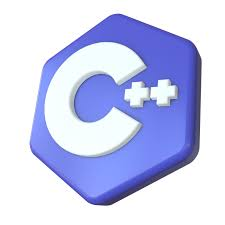

# Estudo da linguagem c 
## Aplicada a lógica de programação e algoritmos
<p align="centrer">

</p> 

---

estudo das principais estruturadas da liguagem de 
programação c.

*Varíaveis
*comandos de Entrada e Saída (IO-input output):
    * printf 
    * scanf
* Desvio de fluxo Simples (if ... )
* Desvio de fluxo Multiplo (if ... else )
*Estrutura de Repetição While(Enquanto)
*Estrutura de repetição For(Para)
*Função (Módulo)
    - Função Interna (Dentro do arquivo .c)
    - Função Externa (Dentro do arquivo .h)
* Ponteiro
*Criação de arquivo


#### Demostração de uma estrutura simples de arquivo .c

``` c
#include <stdio.h>

int main(){

    int n;
    printf("Digite um número inteiro e tecle Enter\n");
    scanf("%d" ,&n);

    if( n % 2 == 0) {

        printf("O número %d é Par\n ,n" ,n);

        
    }
        return 0;

#### Dmostração da estrutura de repetição 

```c

#include <stdio.h>

int main(){
    int linha, coluna;
    linha = 1;
    coluna = 1;

    while(linha <= 10){
        while(coluna <= 30){
            printf("#");
            coluna++;
        }
        //Voltar a contagem da coluna ao valor
        //inicial 1
        coluna = 1;
        printf("\n");
        linha++;
    }
    return 0;
}